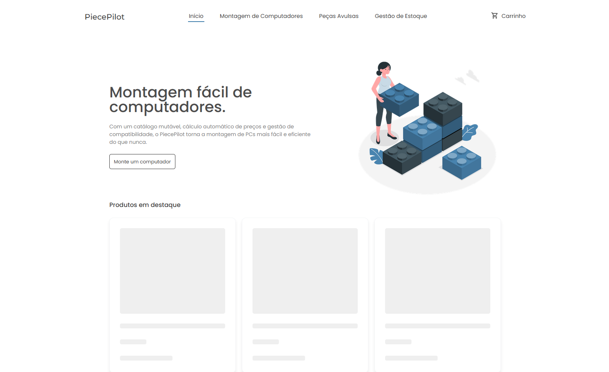

# ✈️ PiecePilot

O PiecePilot é o seu co-piloto na jornada de construir o computador perfeito. Destinado a vendedores de peças de computadores e entusiastas de tecnologia, este software intuitivo simplifica a seleção de peças e guia você na criação de sistemas de computador personalizados. Com um catálogo abrangente, cálculo automático de preços, histórico de pedidos e comunicação integrada, o PiecePilot torna a montagem de PCs mais fácil e eficiente do que nunca. Suba a bordo e leve a sua experiência de construção de PCs para novos patamares com o PiecePilot ao seu lado.

## Front-end

### Dependências

1. Para executar a aplicação Front-end é necessário [instalar o node](https://nodejs.org/en/download).
2. Dentro do diretório `frontend` instale as dependências do projeto executando `npm install`.

### Executando

Para abrir a aplicação front-end em ambiente de desenvolvimento (APIs apontando para o host local) execute o comando `npm run start:dev`. Caso deseje executar em ambiente de produção (URL da API ausente - Produção não implementada) use `npm run start:prod`.

### Build, Test e Eject

Assim como o `start` todos os outros scripts presentes no `package.json` precisam ter o ambiente informado, isso é, utilizando os dois pontos após o nome do script. Exemplos: `npm run build:prod`, `npm run build:dev`, etc.

## Back-end

### Dependências

Para executar aplicação back-end é necessário terem instalado em seu computador [Java](https://www.java.com/pt-BR/download/) e a ferramenta [Maven](https://maven.apache.org/install.html).

### Executando

Para executar a aplicação Back-end, basta, no VSCode, clicar com o botão direito no arquivo `/backend/src/main/java/br/com/piecepilot/backend/BackendApplication.java` e selecionar `Run Java`, ou então, em um terminal, executar o comando `mvn spring-boot:run` estando no diretório `backend`.
